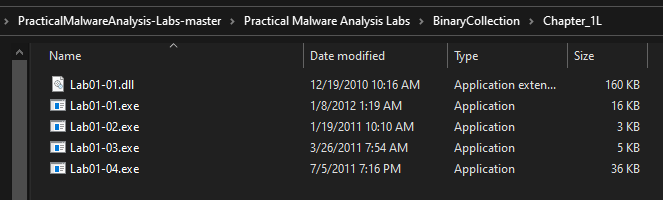
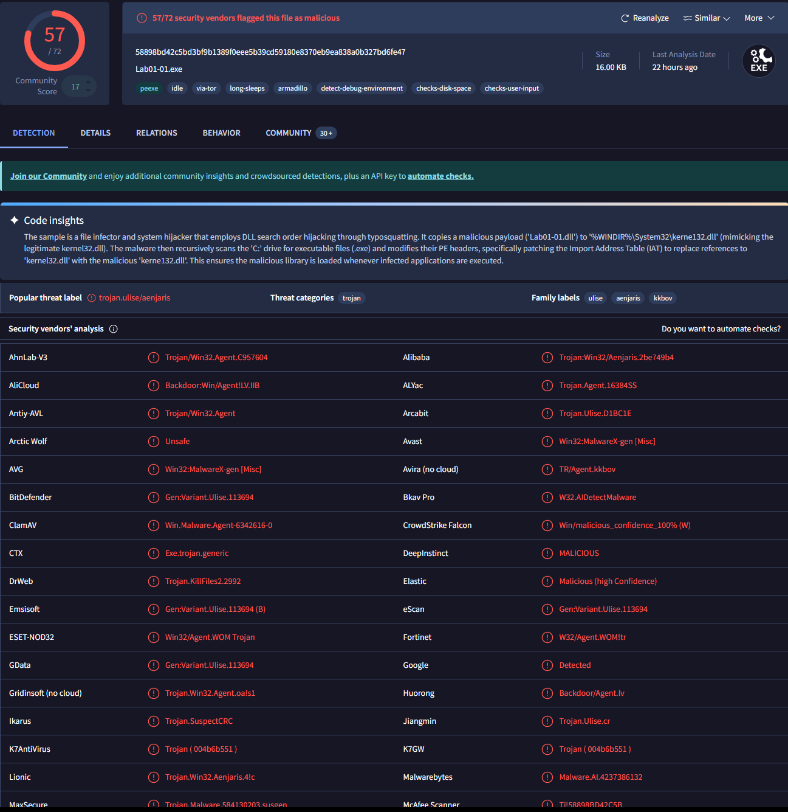
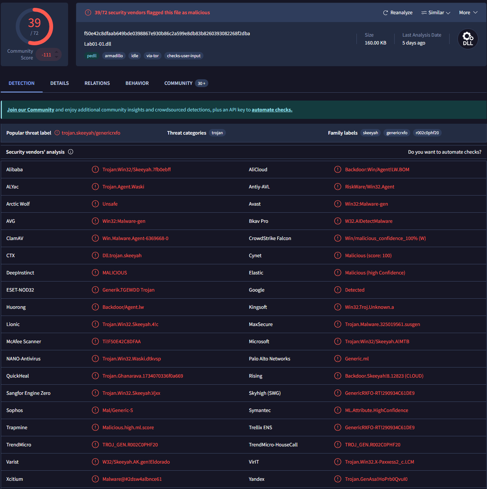
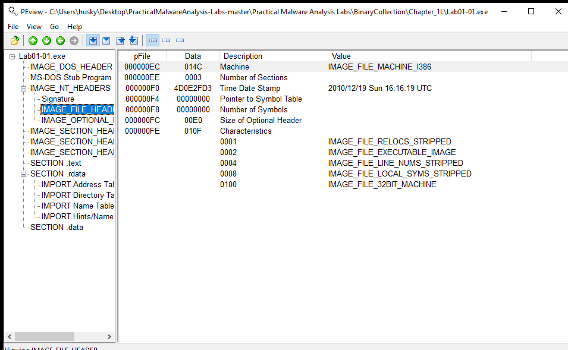
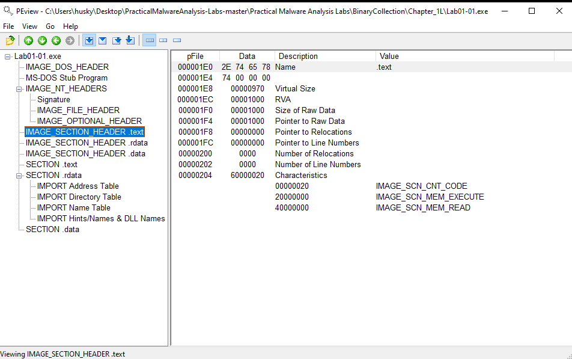
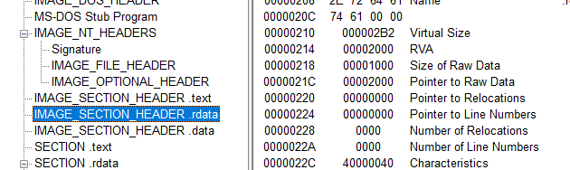
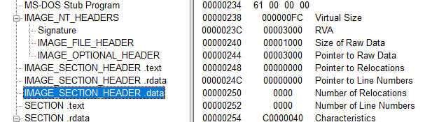

# Lab 1-1

**NOTE : this lab is not supposed to perform in an isolated lab but i am performing it just to be safe**

files - Lab01-01.exe and Lab01-01.dll

         

Q-1 : upload to VT and match sign

       

This Img is for .exe

     

This img is for .dll file

This files are matching with the **Trojan** signature

Q-2 : When were this file compiled?

To check this i have to check the PE Header, basically metadata

TOOL i am going to use is that PEView.

Q-3 : is it packed? yes than show the indicators.

To check that is it packed or not we will compare the virtual size to size of raw data. if there is a huge difference than it is packed if not than it is not packed simple :)!   

Here we can see in section .text there is not much difference in size like 0970 and 1000 which is almost same

let see other sections too....

in this two section there is a difference...

one more thing is odd is that size of raw data is same in every section which is 1000 so i think this malware is packed.

Q-4 : check for imports that say it is a malware?

I am using TOOL called Dependacy walker to check the imports

